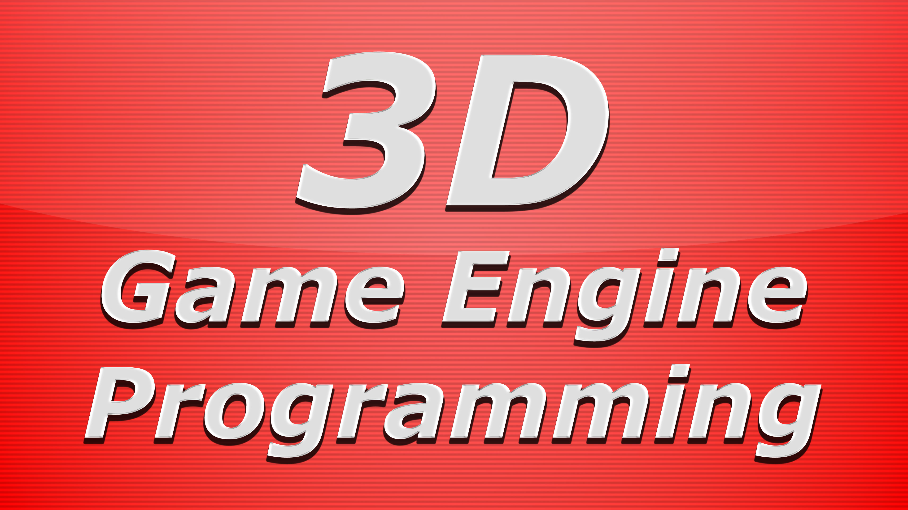

# 3D Game Engine Programming

Helping you build your dream game engine

**3D Game Engine Programming** (3dgep) is an educational resource for teaching new (and old) game developers about game engine programming. The primary focus of 3dgep is graphics programming and teaching the graphics API's like OpenGL, DirectX and Vulkan but teaches other game engine programming related topics such as audio, physics, and general game engine related topics.

> 📝 This website is currently under development

Check out the website here: [https://3dgep.github.io](https://3dgep.github.io).